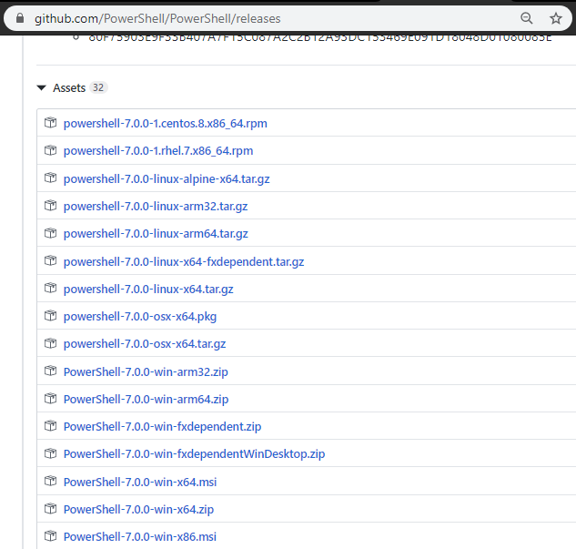
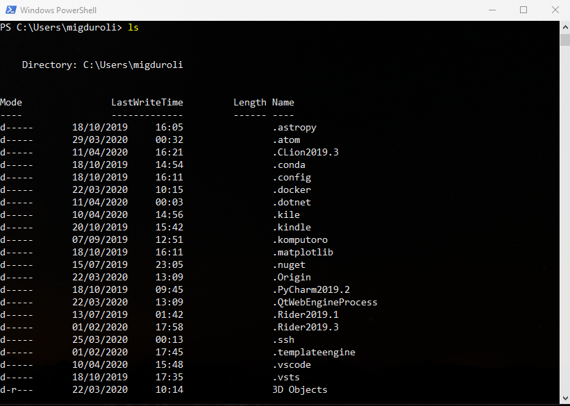
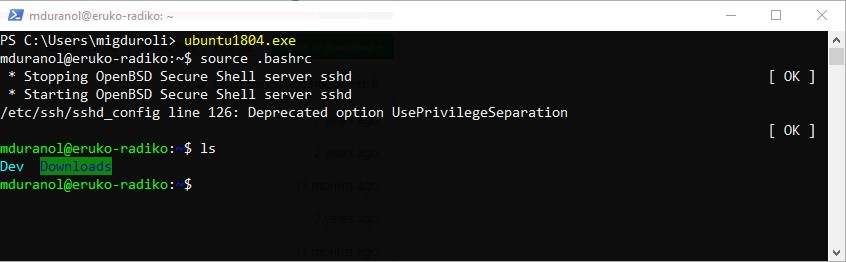
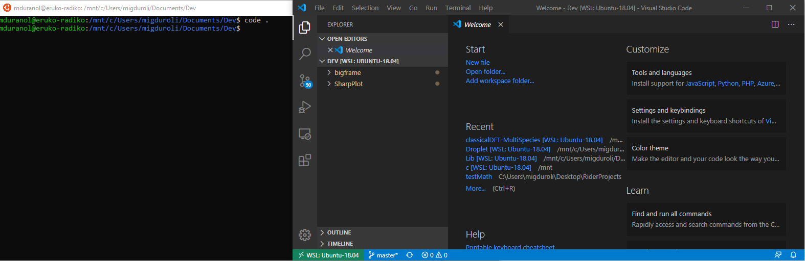
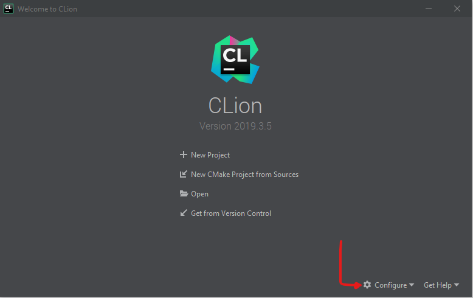
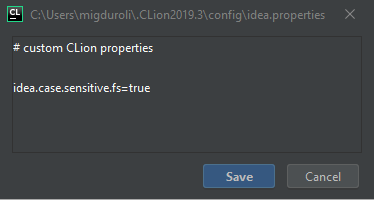
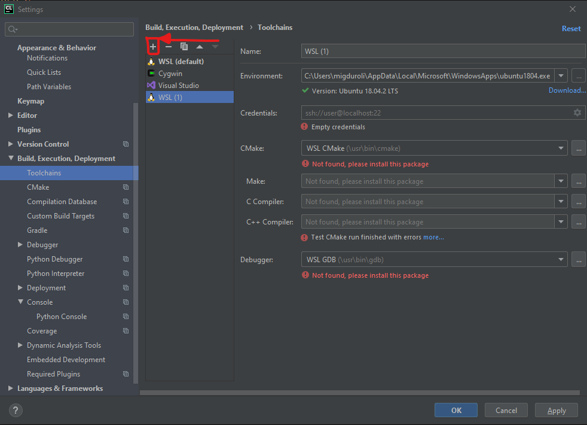
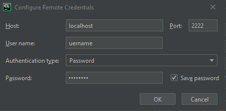
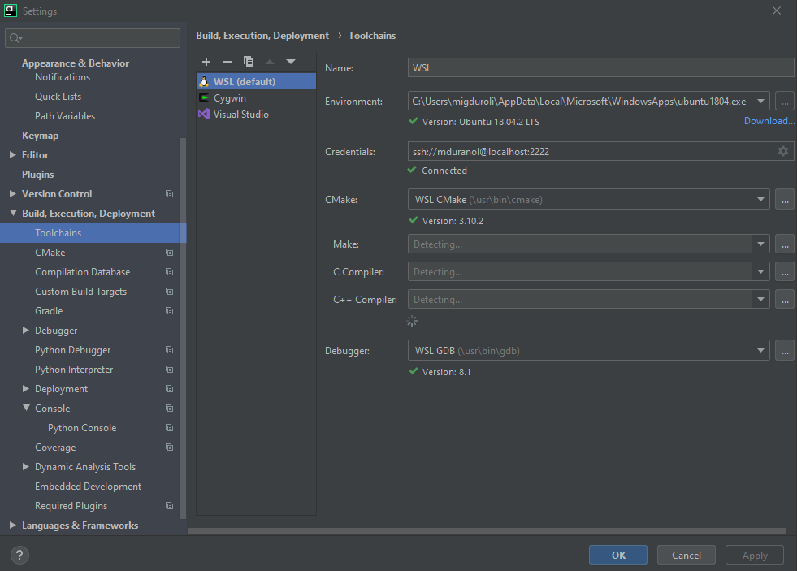

# classicalDFT

The library [classicalDFT](https://github.com/jimlutsko/classicalDFT ) is a `C++` project which is mainly thought to work on **Linux** systems. However, this does not mean we cannot use the library on a **Windows** environment (as long as we use `version>=Win10`) or an **OSX** environment. In what follows, a detailed explanation on how to set up [classicalDFT](https://github.com/jimlutsko/classicalDFT ) on the different possible platforms is given. 

## Linux

As we've just mentioned, classicalDFT is natively developed under linux. Thus, the set up here boils down to ensure we have all the requirements installed appropriately. The following steps can be easily reproduce in almost any Linux environment, although they've been 100% tested under Ubuntu 18.04LTS:

* C++ compilers, gdb, ssh, rsync, ninja, and zip. On Debian-based systems, you can use this command to install these dependencies:

  ```cmd
  > sudo apt install -y openssh-server build-essential gdb rsync ninja-build zip
  ```

* A recent version of [CMake]( https://cmake.org/download/ ) on the Linux machine that has server mode enabled (at least 3.8). You can get the CMake binaries from [the Microsoft fork of the CMake repo](https://github.com/Microsoft/CMake/releases) on GitHub. Go to that page and download the version that matches the system architecture on your Linux machine, then mark it as an executable, e.g:

  ```cmd
  > wget https://github.com/microsoft/CMake/releases/download/v3.17.3587832/cmake-3.17.3587832-MSVC_2-Linux-x64.sh
  > chmod a+x cmake-3.17.3587832-MSVC_2-Linux-x64.sh
  > sudo ./cmake-3.17.3587832-MSVC_2-Linux-x64.sh --skip-license --prefix=/usr
  ```

* [GSL]( https://www.gnu.org/software/gsl/ ) need to be installed:

  ```cmd
  > sudo apt-get install libgsl-dev
  ```

* [FFTW3](http://www.fftw.org/) is a library designed to compute discrete Fourier transforms. As described in the the official website, there are various versions available, with different features and different levels of maturity. We can install the development version as follows:

  ```cmd
   > sudo apt-get install libfftw3-dev libfftw3-doc
  ```

* [Grace]( http://plasma-gate.weizmann.ac.il/Grace/ )  plotting tool for the X Window System. Grace runs on practically any version of Unix-like OS. It is a tool used across the library with the aim of providing a graphical support in various numerical tasks. An alternative can be [GnuPlot]( http://www.gnuplot.info/ ), for which we will also give a wrapper and instructions to install:

  ```cmd
  > sudo apt-get update -y
  > sudo apt-get install -y grace
  > sudo apt-get install -y gnuplot
  ```

* [Armadillo](http://arma.sourceforge.net/) a high quality linear algebra library (matrix maths) for the C++ language. The installation is pretty standard:

  ```bash
  > sudo apt-get install -y libarmadillo-dev
  ```

* [Google Test](https://github.com/google/googletest) a testing framework developed by Google's Testing Technology team. This library is a bit trickier than the prototypical `sudo apt-get install`. This is because there was a [deliberate decision](https://askubuntu.com/questions/145887/why-no-library-files-installed-for-google-test/145913#145913) to stop distributing the static libraries, in order to guarantee correct working of the library.  Thus, `libgtest-dev` is now stored in `/usr/src/googletest/googletest`. Hence, we should make symbolic links to the **googletest** folder. Following these instructions should make it work (see [also](https://gist.github.com/Cartexius/4c437c084d6e388288201aadf9c8cdd5)): 

  ```bash
  > sudo apt-get install libgtest-dev
  > cd /usr/src/googletest/googletest
  > sudo mkdir build
  > cd build
  > sudo cmake ..
  > sudo make
  > sudo cp libgtest* /usr/lib/
  > cd ..
  > sudo rm -rf build
  ```

  Then do:

  ```bash
  > sudo mkdir /usr/local/lib/googletest
  > sudo ln -s /usr/lib/libgtest.a /usr/local/lib/googletest/libgtest.a
  > sudo ln -s /usr/lib/libgtest_main.a /usr/local/lib/googletest/libgtest_main.a
  ```

With all the previous steps, the WSL/Ubuntu system must be already prepared for the use and development of our library. 

## OSX

The steps to follow under OSX are quite similar to those followed for [Linux](#Linux).

## Windows10 

MS Windows allows us to natively use something called [Windows Subsystem for Linux (WSL)]( https://en.wikipedia.org/wiki/Windows_Subsystem_for_Linux ) ever since August 2016, with its first stable release (**WSL2**) being available ever since June 2019. We need to have WSL active in our system for the set up to be possible.

### Activating WSL

The first step is to activate the WSL in our OS. For this we have several options, although we're going for the most programmatic of all, which is by utlising [PowerShell]( https://docs.microsoft.com/en-us/windows/wsl/install-win10 ).  

#### Installing PowerShell

Windows PowerShell comes installed by default in every Windows, so you don't need to be worried about this installation. However, you can always try and update the version if you are not sure you have the correct version, or you just simply want to update your version. For this, you just need to download the install package from our GitHub [releases](https://github.com/PowerShell/PowerShell/releases) page. Scroll down to the **Assets** section of the Release page. The **Assets** section may be collapsed, so you may need to click to expand it. 



The installable package is an MSI file, which should looks like `PowerShell--win-.msi`. For example:

- `PowerShell-7.0.0-win-x64.msi`
- `PowerShell-7.0.0-win-x86.msi`

Once downloaded, just *double-click* the installer and follow the prompts. The installer will create a shortcut in the Windows Start Menu. After running the main executable you will be able to get the PowerShell terminal



#### Activating WSL from PowerShell

The following text follows the set of instructions provided by Microsoft ([link]( https://docs.microsoft.com/en-us/windows/wsl/install-win10 )). 

1.  Open PowerShell as Administrator and run: 

   ```powershell
   Enable-WindowsOptionalFeature -Online -FeatureName Microsoft-Windows-Subsystem-Linux
   ```

   This ensures that the "Windows Subsystem for Linux" optional feature is enabled. 

2.  Restart your computer when prompted. 

3. To download distros using PowerShell, use the [Invoke-WebRequest](https://msdn.microsoft.com/powershell/reference/5.1/microsoft.powershell.utility/invoke-webrequest) cmdlet. Here's a sample instruction to download Ubuntu 18.04, which is the one we recommend:

   ```powershell
   Invoke-WebRequest -Uri https://aka.ms/wsl-ubuntu-1604 -OutFile Ubuntu.appx -UseBasicParsing
   ```

   Another option could be by using the `curl` command 

   ```powershell
   curl.exe -L -o ubuntu-1804.appx https://aka.ms/wsl-ubuntu-1804
   ```

4. Extract the `.appx` package's contents:

   ```powershell
   Rename-Item .\Ubuntu.appx .\Ubuntu.zip
   Expand-Archive .\Ubuntu.zip .\Ubuntu
   ```

5. Run the distro launcher To complete installation, run the distro launcher application in the target folder, named `.exe`. For example: `Ubuntu.exe

6. Add your distro path to the Windows environment PATH (`C:\Users\Administrator\Ubuntu` in this example), e.g. using Powershell: 

   ```powershell
   $userenv = [System.Environment]::GetEnvironmentVariable("Path", "User")
   [System.Environment]::SetEnvironmentVariable("PATH", $userenv + ";C:\Users\Administrator\Ubuntu", "User")
   ```

   You can now launch your distro from any path by typing `.exe`. For example: `ubuntu.exe`. 

### Setting up WSL-Ubuntu

Let's open the `PowerShell` terminal and run:

```powershell
> ubuntu1804.exe
> source .bashrc
```

which should result in something like the following picture:



Thus, Ubuntu is up and running in Windows10. As of this point, you can follow the steps explained above for the set up under [Linux](#Linux).

The development cycle can be entirely carried out via terminal commands, without the need of any programming GUI. If this is your case, you can stop reading already, you're done, congrats! For those utilizing a GUI such as VS Code, you can keep on reading the next section, so that you can keep working with your favourite GUI on Windows but compiling in WSL/Ubuntu.

#### Fixing error due to metadata

It might happen to you that when using cmake for building the project you struggle with messages like:

```bash
CMake Error at /usr/share/cmake-3.7/Modules/CMakeDetermineCCompiler.cmake:175 (configure_file):
  configure_file Problem configuring file
Call Stack (most recent call first):
  CMakeLists.txt
```

If this is the case, it could be the case that metadata is not enabled on your `/mnt/c`. To enable metadata on your `/mnt/c`:

```
> sudo vim /etc/wsl.conf
```

and add:

```bash
[automount]
enabled = true
options = "metadata"
```

This change [won't take effect](https://github.com/microsoft/WSL/issues/3994) right away. We recommend `wsl --terminate` or a reboot the OS to be sure that the metadata is enabled.

#### Visual Studio Code

If you are one of those persons who prefer to have an all-in-one package where you can be compiling, developing and also health checking your code, with the amazing offer of code navigation, and so on and so forth, which is offered by professional GUIs like  [VS Code]( https://code.visualstudio.com/ ), we're here to help you in setting up your lightweight but powerful source code editor to load the WSL terminal.

The reality is that the process is pretty simple:

1. In the WSL terminal, go to the path `/mnt/c/Users/<yourusername>/Documents/`

2. There create a specific folder for your future projects, e.g. `Dev`:

   ```cmd
   > mkdir Dev
   > cd Dev
   ```

3.  Type in `'code .'` to launch Visual Studio Code. The `'.'` argument tells VS Code to open the current folder.

   > **Note:** If this command does not work, you may need to restart your terminal or you may not have added VS Code to your path when it was installed.

   

4. Now click on `Terminal > New Terminal`. This will open a WSL-Ubuntu terminal.
5. That's all!

#### CLion

If you prefer a heavier source code editor which gives you many more specific tools for debugging, CI/CD, etc. you might be considering [CLion]( https://www.jetbrains.com/clion/ ). If this is your case, you might be interested in knowing that there is a very simple way of connecting your GUI with the WSL terminal. The steps are the following:

1. Go to your WSL terminal and open VIM:

   ```
   > vim clion_wsl.sh
   ```

2. Then add the following script:

   ```bash
   #!/bin/bash
   set -e
   
   SSHD_LISTEN_ADDRESS=127.0.0.1
   if [ -e "/dev/vsock" ]; then # in case of WSL2
   		SSHD_LISTEN_ADDRESS=0.0.0.0
   	fi
   
   	SSHD_PORT=2222
   	SSHD_FILE=/etc/ssh/sshd_config
   	SUDOERS_FILE=/etc/sudoers
   	  
   	# 0. update package lists
   	sudo apt-get update
   
   	# 0.1. reinstall sshd (workaround for initial version of WSL)
   	sudo apt remove -y --purge openssh-server
   	sudo apt install -y openssh-server
   
   	# 0.2. install basic dependencies
   	sudo apt install -y cmake gcc clang gdb valgrind build-essential
   
   	# 1.1. configure sshd
   	sudo cp $SSHD_FILE ${SSHD_FILE}.`date '+%Y-%m-%d_%H-%M-%S'`.back
   	sudo sed -i '/^Port/ d' $SSHD_FILE
   	sudo sed -i '/^ListenAddress/ d' $SSHD_FILE
   	sudo sed -i '/^UsePrivilegeSeparation/ d' $SSHD_FILE
   	sudo sed -i '/^PasswordAuthentication/ d' $SSHD_FILE
   	echo "# configured by CLion"      | sudo tee -a $SSHD_FILE
   	echo "ListenAddress ${SSHD_LISTEN_ADDRESS}"	| sudo tee -a $SSHD_FILE
   	echo "Port ${SSHD_PORT}"          | sudo tee -a $SSHD_FILE
   	echo "UsePrivilegeSeparation no"  | sudo tee -a $SSHD_FILE
   	echo "PasswordAuthentication yes" | sudo tee -a $SSHD_FILE
   	# 1.2. apply new settings
   	sudo service ssh --full-restart
   	  
   	# 2. autostart: run sshd 
   	sed -i '/^sudo service ssh --full-restart/ d' ~/.bashrc
   	echo "%sudo ALL=(ALL) NOPASSWD: /usr/sbin/service ssh --full-restart" | sudo tee -a $SUDOERS_FILE
   	cat << 'EOF' >> ~/.bashrc
   sshd_status=$(service ssh status)
   if [[ $sshd_status = *"is not running"* ]]; then
     sudo service ssh --full-restart
   fi
   EOF
        
   # summary: SSHD config info
   echo 
   echo "SSH server parameters ($SSHD_FILE):"
   echo "ListenAddress ${SSHD_LISTEN_ADDRESS}"
   echo "Port ${SSHD_PORT}"
   echo "UsePrivilegeSeparation no"
   echo "PasswordAuthentication yes"
   ```

3. Add executable permissions and run it:

   ```cmd
   > chmod a+x clion_wsl.sh
   > bash clion_wsl.sh
   ```

4. After this, open **CLion**, then go to `Configure > Edit Custom Properties`:

   



5. Save, close and re-open CLion

6. Now, open your project and `File > Settings > Build, Execution, Deployment > Toolchains`

   

7. Click on Add  and Select WSL (you'll get the previous picture), then click on credentials and set up your user and password and set the port to **2222**:

   

8. If everything goes as expected you're done, and you'll see your previous windows as follows:

   

#### Visual Studio 2019

For this you only need to follow the first 3 steps explained before for CLion. Then, open Visual Studio 2019 and:

1. Open the repository
2. Go to `Tool > Options > Cross Platform > Connection Manager > Add`
3. Follow the steps 7-8 of the previous section, i.e. configure your username, password and the localhost **PORT = 2222**

And you are done!
