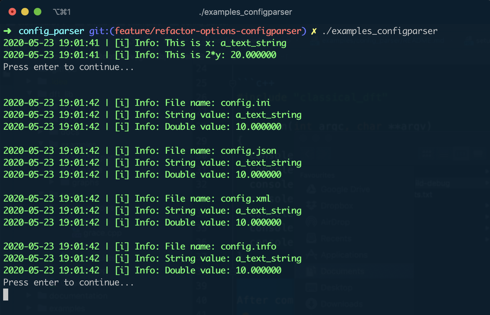

# ConfigParser

### Introduction

The `ConfigParser` class aims at providing a simple tool to deal with configuration/input files. 

But, *why'd we need any configuration file in any case?* If you've worked in any programming project, it's very likely (if not almost fully certain) you've needed to use at some point some *local/global variables* which defined the behaviour of the program/application. Such variables are typically numerical or string-like values which are used thereafter in the project repeatedly. As an example, let's imagine we're working in a numerical project which simulates the time-evolution of a particle's position in space. This task might involve more or less difficult methods to be implemented depending on whether we want to consider classical or relativistic dynamics. Nevertheless, there is something that won't change, the integration of the equations of motion depends on the **initial position** of the particle. At first, we might be tempted to **hard code** such initial conditions directly in our application code. Nevertheless, what would happen should we need to simulate the same problem but for different initial conditions? Do we really want to re-compile the whole program just to change a few parameters? Of course not! This is where configuration files come into play. The best practice indeed is to delegate the responsibility of global-variables definition to the user, who will need to provide such parameters via an external file. This standard practice allows us to reduce the number of recompilation and give the code a more general character. And this is where our class `config_parser::ConfigParser` comes in. Just for the sake of the argument, compare the following pieces of code:

* Hard coding variables:

  ```c++
  #include "my_physics_library/newton_dynamics.hpp"
  
  int main()
  {
    double x0 = 1.0;
    double y0 = 1.0;
    double z0 = 1.0;
    
    std::string output_file = "output.dat"
      
    // Time-integration of Newton's law => Export in output_file
    newton_dynamics.simulate(x0, y0, z0, output_file);
  }
  ```

* Parameters in external file:

  ```c++
  #include "my_physics_library/newton_dynamics.hpp"
  #include "dft_lib/utils/config_parser.h"
  
  int main()
  {
    //Defining the file to read:
    auto config = config_parser::ConfigParser("config.ini");
    
    //Reading the parameters from the config file:
    auto x0 = config.tree.get<double>("initial_position.x");
    auto y0 = config.tree.get<double>("initial_position.y");
    auto z0 = config.tree.get<double>("initial_position.z");
  
    //Defining the file name:
    auto output_file_header = config.tree.get<std::string>("output.file_name_header");
    auto output_file_ext = config.tree.get<std::string>("output.file_extension");
    auto output_file = output_file_header + "_" 
      + std::to_string(x0) + "." 
      + std::to_string(y0) + "." 
      + std::to_string(z0) + "." 
      + output_file_ext;
      
    // Time-integration of Newton's law => Export in output_file
    newton_dynamics.simulate(x0, y0, z0, output_file);
  }
```
  
Where `config.ini` would look like:
  
  ```
  [initial_position]
  x = 1.0
  y = 1.0
  z = 1.0
  
  [output]
  file_name_header = out
  file_extension = dat
  ```

Although the first version is likely the faster to write, it's also the most ineffective if we need to use this program to simulate a bunch of trajectories, as we'd need to modify the source code and recompile every time, besides having to change the name of the file to avoid overwriting the previous simulations. 

In the following section we provide with a couple of examples to show the convenience offered by the `config_parser::ConfigParser` class.

### Examples

The following examples make use of the files placed in [examples](examples/config_parser/config_files). There, you can find a short example of every config-file format supported, namely **JSON**, **INI**, **XML** and **INFO**. 

The following simple piece of code shows some of the functionality mentioned above (code from   [main.cpp](main.cpp)):  

```c++
#include "classical_dft"
#include <boost/range/combine.hpp>

int main() {
  using namespace dft_core;

  //region Default Cttor:

  auto config = config_parser::ConfigParser();
  auto x = config.tree().get<std::string>("default.StringValue");
  auto y = config.tree().get<double>("default.DoubleValue");

  console::Info("This is x: " + x);
  console::Info("This is 2*y: " + std::to_string(2*y));

  console::Wait();

  //endregion

  //region Specific Cttor: All file formats

  std::vector<dft_core::config_parser::FileType> types {
      dft_core::config_parser::FileType::INI,
      dft_core::config_parser::FileType::JSON,
      dft_core::config_parser::FileType::XML,
      dft_core::config_parser::FileType::INFO
  };

  std::vector<std::string> files {
      "config.ini",
      "config.json",
      "config.xml",
      "config.info"
  };

  std::string f;
  dft_core::config_parser::FileType t;

  for (const auto& tuple : boost::combine(types, files)) {
    boost::tie(t, f) = tuple;
    auto c_obj = dft_core::config_parser::ConfigParser(f, t);

    std::string section = (c_obj.config_file_path().find("info") == std::string::npos) ? "default." : "";
    auto string_value = c_obj.tree().get<std::string>(section + "StringValue");
    auto double_value = c_obj.tree().get<double>(section + "DoubleValue");

    console::NewLine();
    console::Info("File name: " + f);
    console::Info("String value: " + string_value);
    console::Info("Double value: " + std::to_string(double_value));
  }
  console::Wait();

  //endregion
}
```

After compilation and running, it will produce the following output:

