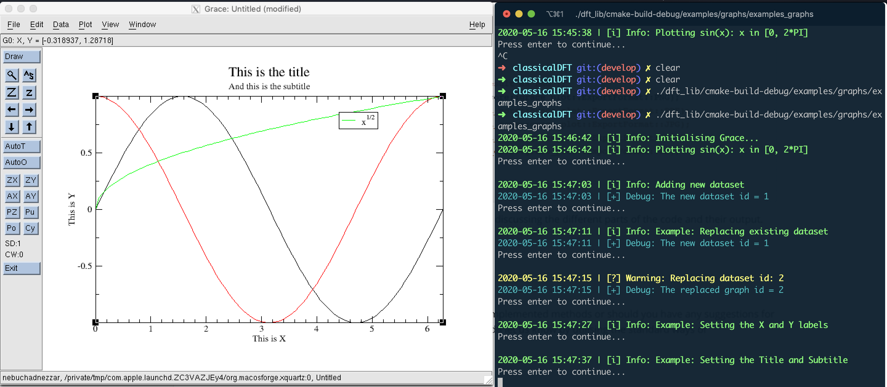

# Grace wrapper

### Introduction

One of the main challenges of any numerical project, as is the case of `classicalDFT`, is the tracking of the results being obtained. This is of remarkable importance in any iterative process whose stoping depends on the fulfilment or not of certain numerical criteria, e.g. convergence/distance measures, tolerance matrix values, etc. Obviously, this can always be printed out via console writing. However, a more useful way tends to be the graphical representation of such quantities/measures *in live*. This is why the live connectivity to graphical tools allowing us to can dump large amounts of data for graphical representation, without having to stop the numerical algorithm, is of crucial importance. No need to say, how convenient is the use of such tools for quick "testing" a proof of concept. For this reason, we've chosen a quite simple yet powerful tool which fulfils our needs, the free-software [grace](https://plasma-gate.weizmann.ac.il/Grace/doc/UsersGuide.html#ss1.1). 

Besides being free, grace offers the basic functionality we require for most of our numerical problems. However, the interface offered by its free headers (written in `C`) is quite verbose, which is why we thought convenient to develop a wrapper 100% unit-tested to look alike some of the modern graphical libraries for, say, `Python`.

Our wrapper lives within the `dft_core` namespace, which is the core namespace of the `classicalDFT` library, and is encapsulated within the namespace `grace_plot`. The wrapper consists mainly in a `class` and several `enum` structures. Basically:

* `grace_plot::command`: This is a namespace where we have gathered all the relevant grace commands as standard strings, which will be used in the `Grace` implementation
* `grace_plot::Color`: This is an `enum` which contains all the colours available in grace
* `grace_plot::Axis`: An `enum` to contain all possible axes, i.e. `X` and `Y`
* `grace_plot::Symbol`: The `enum` containing all possible symbol shapes to be used when representing data
* `grace_plot::ExportFormat`: An `enum` with all possible exporting formats
* `grace_plot::Grace`: The `class` wrapping `grace_np.h`. This class provides an interface for the xmgrace graphics program which can be called programmatically to provide a tactical solution for displaying dynamically updated line graphs etc.

### Examples

The best way of showing the convenience offered by `grace_plot::Grace` is by example. Thus, we are going to proceed by inserting the code in `main.cpp`:

```c++
#include <cmath>
#include <armadillo>
#include "classical_dft"

int main(int argc, char **argv)
{
  console::Info("Initialising Grace...");

  //region Cttor
  auto g = dft_core::grace_plot::Grace();
  const int N_POINTS = 100;
  //endregion

  //region Example of adding points to the default dataset 0
  console::Info("Plotting sin(x): x in [0, 2*PI]");

  auto x_vector = arma::linspace(0, 2*M_PI, N_POINTS);
  auto y_vector = arma::sin(x_vector);

  for (auto k = 0; k < x_vector.size(); k++)
  { g.AddPoint(x_vector[k], y_vector[k]); }

  g.SetXLimits(x_vector.min(), x_vector.max());
  g.SetYLimits(y_vector.min(), y_vector.max());

  g.RedrawAndWait();
  //endregion

  //region Example of adding dataset
  console::Info("Adding new dataset");
  arma::vec z_vector = arma::cos(x_vector);

  auto dataset_id = g.AddDataset(
      arma::conv_to<std::vector<double>>::from(x_vector),
      arma::conv_to<std::vector<double>>::from(z_vector)
  );
  console::Debug("The new dataset id = " + std::to_string(dataset_id));
  g.SetColor(dft_core::grace_plot::Color::RED, dataset_id);
  g.RedrawAndWait();
  //endregion

  //region Example of replacing dataset
  console::Info("Example: Replacing existing dataset");
  arma::vec w_vector = arma::tan(x_vector);

  auto existing_dataset_id = g.AddDataset(
      arma::conv_to<std::vector<double>>::from(x_vector),
      arma::conv_to<std::vector<double>>::from(w_vector)
  );
  console::Debug("The new dataset id = " + std::to_string(dataset_id));
  g.SetColor(dft_core::grace_plot::BLUE, existing_dataset_id);
  g.RedrawAndWait();

  console::Warning("Replacing dataset id: " + std::to_string(existing_dataset_id));
  w_vector = arma::sqrt(x_vector)/sqrt(2*M_PI);
  g.ReplaceDataset(
      arma::conv_to<std::vector<double>>::from(x_vector),
      arma::conv_to<std::vector<double>>::from(w_vector),
      existing_dataset_id
  );
  console::Debug("The replaced graph id = " + std::to_string(existing_dataset_id));

  g.SetLegend("x\\S1/2\\N", existing_dataset_id);
  //g.SetColor(dft_core::grace_plot::MAGENTA, existing_dataset_id);
  g.RedrawAndWait();
  //endregion

  //region Example of axis labels
  console::Info("Example: Setting the X and Y labels");
  g.SetLabel("This is X", dft_core::grace_plot::Axis::X);
  g.SetLabel("This is Y", dft_core::grace_plot::Axis::Y);
  g.RedrawAndWait();
  //endregion

  //region Example of graph title
  console::Info("Example: Setting the Title and Subtitle");
  g.SetTitle("This is the title");
  g.SetSubtitle("And this is the subtitle");
  g.RedrawAndWait();
  //endregion

  //region Example of setting limits
  console::Info("Example: Setting the limits");
  g.SetLimits(std::vector<double>{ -0.1, 2*M_PI+0.1 }, std::vector<double>{-1.2, 1.2});
  g.RedrawAndWait();
  //endregion

  //region Example of setting ticks
  console::Info("Example: Setting the tick spacing");
  g.SetTicks(0.5, 0.1);
  g.RedrawAndWait(false, false);
  //endregion

  //region Example of setting line type
  console::Info("Example: Setting the line type");
  g.SetLineType(dft_core::grace_plot::LineType::NO_LINE, 0);
  g.RedrawAndWait(false, false);
  g.SetLineType(dft_core::grace_plot::LineType::LINE, 0);
  g.RedrawAndWait(false, false);
  g.SetLineType(dft_core::grace_plot::LineType::DOTTEDLINE, 0);
  g.RedrawAndWait(false, false);
  g.SetLineType(dft_core::grace_plot::LineType::DASHEDLINE_EN, 0);
  g.RedrawAndWait(false, false);
  //endregion

  //region Example of setting symbols and fills
  console::Info("Example: Setting symbol and symbol color");
  g.SetSymbol(dft_core::grace_plot::Symbol::TRIANGLE_DOWN, 0);
  g.SetSymbolColor(dft_core::grace_plot::Color::BLUE, 0);
  g.SetSymbolFill(dft_core::grace_plot::Color::BLUE, 0, 0, 4);

  g.SetSymbol(dft_core::grace_plot::Symbol::TRIANGLE_LEFT, 1);
  g.SetSymbolColor(dft_core::grace_plot::Color::DARKGREEN, 1);

  g.SetSymbol(dft_core::grace_plot::Symbol::DIAMOND, 2);
  g.SetSymbolFill(dft_core::grace_plot::Color::RED, 2);
  g.RedrawAndWait(false, false);
  //endregion

  //region Example of setting symbol size
  console::Info("Example: Setting symbol size");
  g.SetSymbolSize(0.5,0);
  g.SetSymbolSize(1.5,1);
  g.RedrawAndWait(false, false);
  //endregion

  //region Example of Export
  console::Info("Example: Saving the result as PNG");
  g.PrintToFile("test_graph.png", dft_core::grace_plot::ExportFormat::PNG);
  //g.PrintToFile("test_graph.pdf", dft_core::grace_plot::ExportFormat::PDF);
  //g.PrintToFile("test_graph.jpg", dft_core::grace_plot::ExportFormat::JPG);
  //g.PrintToFile("test_graph.eps", dft_core::grace_plot::ExportFormat::EPS1);
  //g.PrintToFile("test_graph.ps", dft_core::grace_plot::ExportFormat::PS);
  g.RedrawAndWait(false, false);
  //endregion
}
```

We have used `regions` with the aim of better discussing the different parts of the code and their output. After compilation and running we will get the following results (we have left the terminal opened on the right hand side to better show the flow of the program):

#### Constructor and adding points to the default dataset


#### Adding dataset


#### Replacing dataset


#### Setting axis labels


#### Setting graph title and subtitle



#### Setting limits


#### Setting ticks


#### Setting line type


#### Setting symbol colours and fills


#### Setting symbols size


#### Exporting to all formats

The result of exporting to `ExportFormat::PDF` can be checked here => [test_graph.pdf](figures/export/test_graph.pdf) 

### Issues

Should you find any issue with the currently implemented methods or should you have any suggestions for new functionality to be implemented, please do let us know by utilising the standard ways of communication in [GitHub](https://guides.github.com/features/issues/).