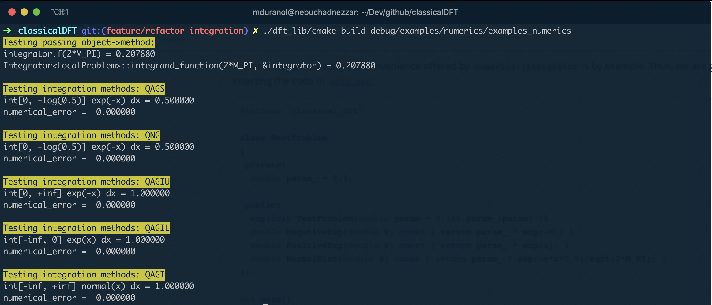

# Integrator wrapper

### Introduction

Numerical integration methods play a central role in a numerical library without any doubt, to say the least. Thankfully, there is an overwhelming amount of free-software and open-source  projects which provide extensive coverage of top-quality (and some even massively peer-reviewed) mathematical routines which allow us to directly solve mathematical problems without having to reinvent the wheel. We believe in [code reuse](https://en.wikipedia.org/wiki/Code_reuse), and for this reason we make use of external libraries which are either free to use or open source. In the particular case of numerical methods, we believe in the use of widely accepted libraries to avoid wasting time and effort, with the ultimate goal of focussing our energies in developing the new numerical routines required by `classicalDFT`. For this reason we make use of the **GNU Scientific Libraries** ([GSL](https://www.gnu.org/software/gsl/doc/html/index.html)). Unfortunately, the original GSL interface is a bit crude and might be even scary for `C++` developers. The aim of the `Integrator` wrapper is nothing but providing the user of `classicalDFT` with a neat programming interface following (inasmuch as possible) the fundamental clean-code principles. 

### Examples

The best way of showing the convenience offered by `numerics::Integrator` is by example. Thus, we are going to proceed by inserting the code in [`main.cpp`](main.cpp):

```c++
#include "classical_dft"

class TestProblem
{
 private:
  double param_ = 0.1;

 public:
  explicit TestProblem(double param = 0.1): param_(param) {}
  double NegativeExp(double x) const { return param_ * exp(-x); }
  double PositiveExp(double x) const { return param_ * exp(x); }
  double NormalDist(double x) const { return param_ * exp(-x*x*0.5)/sqrt(2*M_PI); }
};

int main()
{
  using namespace dft_core;

  auto problem = TestProblem(1.0);
  auto integrator = numerics::Integrator<TestProblem>(problem, &TestProblem::NegativeExp);

  console::WriteLine(console::format::Blink("Testing passing object->method:"));
  console::WriteLine("integrator.f(2*M_PI) = " + std::to_string(integrator.function(M_PI_2)));
  console::WriteLine("Integrator<LocalProblem>::integrand_function(2*M_PI, &integrator) = " + std::to_string(numerics::Integrator<TestProblem>::integrand_function(M_PI_2, &integrator)));

  auto result = integrator.DefiniteIntegral(0, -log(0.5));
  console::NewLine();
  console::WriteLine(console::format::Blink("Testing integration methods: QAGS"));
  console::WriteLine("int[0, -log(0.5)] exp(-x) dx = " + std::to_string(integrator.numerical_result()));
  console::WriteLine("numerical_error =  " + std::to_string(integrator.numerical_error()));

  auto result_fast = integrator.DefiniteIntegralFast(0, -log(0.5));
  console::NewLine();
  console::WriteLine(console::format::Blink("Testing integration methods: QNG"));
  console::WriteLine("int[0, -log(0.5)] exp(-x) dx = " + std::to_string(integrator.numerical_result()));
  console::WriteLine("numerical_error =  " + std::to_string(integrator.numerical_error()));

  auto result_semi_inf = integrator.UpperSemiInfiniteIntegral(0);
  console::NewLine();
  console::WriteLine(console::format::Blink("Testing integration methods: QAGIU"));
  console::WriteLine("int[0, +inf] exp(-x) dx = " + std::to_string(integrator.numerical_result()));
  console::WriteLine("numerical_error =  " + std::to_string(integrator.numerical_error()));

  auto integrator_neg = numerics::Integrator<TestProblem>(problem, &TestProblem::PositiveExp);
  auto result_semi_neg = integrator_neg.LowerSemiInfiniteIntegral(0);
  console::NewLine();
  console::WriteLine(console::format::Blink("Testing integration methods: QAGIL"));
  console::WriteLine("int[-inf, 0] exp(x) dx = " + std::to_string(integrator.numerical_result()));
  console::WriteLine("numerical_error =  " + std::to_string(integrator.numerical_error()));

  auto integrator_gauss = numerics::Integrator<TestProblem>(problem, &TestProblem::NormalDist);
  auto result_gauss = integrator_gauss.FullInfiniteIntegral();
  console::NewLine();
  console::WriteLine(console::format::Blink("Testing integration methods: QAGI"));
  console::WriteLine("int[-inf, +inf] normal(x) dx = " + std::to_string(integrator.numerical_result()));
  console::WriteLine("numerical_error =  " + std::to_string(integrator.numerical_error()));
}
```

After compilation and running we will get the following results:

