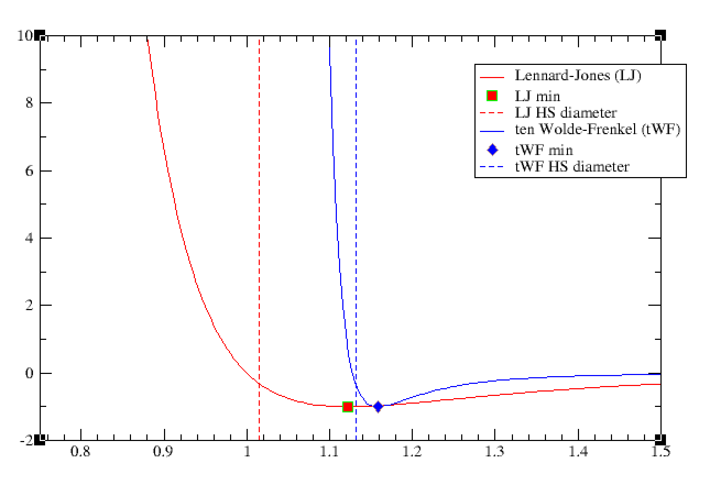

# Intermolecular potentials

### Introduction

One of the few and key elements required when doing research on statistical physics is to have a good estimate (or at least a justifiable model) for the intermolecular potential energy between a pair of constituent particles, e.g. atoms or molecules. The choice of the *intermolecular potential* model describing the intermolecular forces is not something we should come up with hastily, since this **fundamental quantity** governs the thermodynamics of the system at hand. I.e., the same simulation with the same boundary and initial conditions will very likely result in quite different outcomes if we choose to model our system with a [Lennard-Jones](https://en.wikipedia.org/wiki/Lennard-Jones_potential) (LJ) or a [ten Wolde-Frenkel](https://science.sciencemag.org/content/277/5334/1975) (tWF) potential. For this reason, a myriad of potentials have been developed ever since the introduction of the widely-known **LJ(6-12) potential** in 1924 by [John Lennard-Jones](https://en.wikipedia.org/wiki/John_Lennard-Jones). However, most of them share common elements which can be encapsulated in a `base class` to be reutilised for the implementation of every particular one of them. 

The `classicalDFT` library comes with an implementation of such an abstract class which can be found in the namespace `dft_core::physics::potentials::intermolecular`, class `Potential`. Besides this abstract class, `classicalDFT` offers the implementation of the two intermolecular potentials mentioned above, namely LJ(6-12) and the tWF potential, `LennardJones` and `tenWoldeFrenkel` classes under the same namespace. However, the implementations offered here not only come with the basic functionality, but also are enriched with some convenient methods and properties which are required for thermodynamic perturbation theory (TPT) analysis. Particularly, any potential which derives from the abstract class `Potential` will automatically know how to split the potential contribution into two parts (as suggested by [Weeks-Chandler-Andersen TPT](http://www.sklogwiki.org/SklogWiki/index.php/Weeks-Chandler-Andersen_perturbation_theory)): a) hard-sphere (purely repulsive) contribution; and the attractive part. Moreover, the potential-like object also comes with the functionality to compute the hard-sphere, by using the approximation:
$$
d_{\text{HS}} (T) = \int_{r_{\text{HC}}}^{r_1}\left(1-e^{-V(r)/k_BT}\right) dr
$$
Where, $T$ is the absolute temperature of the system (which typically is given through $\beta=(k_BT)^{-1}$); $r_{\text{HC}}$ is the hard-core diameter related to the interaction potential at hand.

**TODO**: Add further explanation about the split of the potential and about each potential used in the classicalDFT library 

### Examples

The best way of showing the convenience offered by the `physics::potentials::intermolecular::Potential` is by example. Thus, we are going to proceed by inserting the code in [`main.cpp`](main.cpp):

```c++
#include "classical_dft"
#include <armadillo>

/// A convenient wrapper to convert arma::vec -> std::vector
auto conv_arma_to_vec(const arma::vec& x)
{
  auto y = arma::conv_to<std::vector<double>>::from(x);
  return y;
}

int main(int argc, char **argv)
{
  console::Info("Initialising Grace...");

  //region Grace set up:
  auto g = dft_core::grace_plot::Grace();
  const int N_POINTS = 200;

  //region Grid set up:
  auto x_vector = arma::linspace(0.75, 1.5, N_POINTS);
  auto y_lims = std::vector<double>{-2, 10};
  g.SetXLimits(x_vector.min(), x_vector.max());
  g.SetYLimits(y_lims[0], y_lims[1]);
  //endregion

  //endregion

  //region Instantiation of the potentials:
  using namespace dft_core::physics::potentials::intermolecular;
  auto lj = LennardJones();
  auto twf = tenWoldeFrenkel();
  //endregion

  //region Lennard-Jones:
  //region potential:
  auto lj_vector = lj.v_potential(x_vector);
  auto lj_ds = g.AddDataset(conv_arma_to_vec(x_vector), conv_arma_to_vec(lj_vector));
  //endregion

  //region minimum:
  auto lj_min = g.AddDataset(std::vector<double>{lj.r_min()}, std::vector<double>{lj.v_min()});
  g.SetLineType(dft_core::grace_plot::LineStyle::NO_LINE, lj_min);
  g.SetSymbol(dft_core::grace_plot::Symbol::SQUARE, lj_min);
  g.SetSymbolFill(dft_core::grace_plot::Color::RED, lj_min);
  //endregion

  //region Hard-sphere diameter:
  auto y_vec = arma::linspace(y_lims[0], y_lims[1], 10);
  auto hs_diameter = lj.FindHardSphereDiameter(1.0);
  auto hs_x = arma::vec(10, arma::fill::ones); hs_x *= hs_diameter;
  auto lj_hs = g.AddDataset(conv_arma_to_vec(hs_x), conv_arma_to_vec(y_vec));
  g.SetColor(dft_core::grace_plot::Color::RED, lj_hs);
  g.SetLineType(dft_core::grace_plot::LineStyle::DASHEDLINE_EN, lj_hs);
  console::Write("d_LJ(T = 1.0) = "); console::WriteLine(hs_diameter);
  //endregion
  //endregion

  //region ten Wolde-Frenkel:
  //region Potential:
  auto twf_vector = twf.v_potential(x_vector);
  auto twf_ds = g.AddDataset(conv_arma_to_vec(x_vector), conv_arma_to_vec(twf_vector));
  g.SetColor(dft_core::grace_plot::Color::BLUE,twf_ds);
  //endregion

  //region Minimum:
  auto twf_min = g.AddDataset(std::vector<double>{twf.r_min()}, std::vector<double>{twf.v_min()});
  g.SetLineType(dft_core::grace_plot::LineStyle::NO_LINE, twf_min);
  g.SetSymbol(dft_core::grace_plot::Symbol::DIAMOND, twf_min);
  g.SetSymbolFill(dft_core::grace_plot::Color::BLUE, twf_min);
  //endregion

  //region Hard-sphere diameter:
  hs_x /= hs_diameter;
  hs_diameter = twf.FindHardSphereDiameter(1.0); hs_x *= hs_diameter;
  auto twf_hs = g.AddDataset(conv_arma_to_vec(hs_x), conv_arma_to_vec(y_vec));
  g.SetColor(dft_core::grace_plot::Color::BLUE, twf_hs);
  g.SetLineType(dft_core::grace_plot::LineStyle::DASHEDLINE_EN, twf_hs);
  console::Write("d_tWF(T = 1.0) = "); console::WriteLine(hs_diameter);
  //endregion
  //endregion

  //region Legend:
  g.SetLegend("Lennard-Jones (LJ)", lj_ds);
  g.SetLegend("ten Wolde-Frenkel (tWF)", twf_ds);
  g.SetLegend("LJ min", lj_min);
  g.SetLegend("tWF min", twf_min);
  g.SetLegend("LJ HS diameter", lj_hs);
  g.SetLegend("tWF HS diameter", twf_hs);
  //endregion

  g.RedrawAndWait();

  //g.PrintToFile("lj-twf-potentials.png", dft_core::grace_plot::ExportFormat::PNG);
  //g.RedrawAndWait();
}
```

After compilation and running we will get the following results:



The figure's quality might seem poor because it has been taken from a screenshot. For a better resolution and quality, you can always use one of the export methods provided by `grace` (as is shown at the bottom of the above code block).