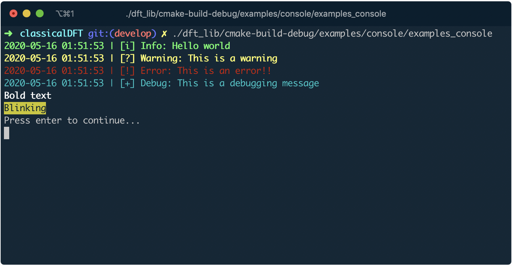

# Console namespace

### Introduction

The idea of the  `console` namespace is to gather some useful functionality when dealing with the standard input/output library from the standard template library (STL). The `console` namespace does not intend to be a substitute or a complete wrapper of `iostream` library. Indeed, it just contains some useful functionality which makes us easier to interact with the terminal when it comes to writing for debugging purposes. This functionality can be categorised by the underlying purpose:

* **Console writing/reading**: Here we find the methods `console::WriteLine`, `console::Write` and `console::ReadLine`, which are inspired by the counterparts in `Java` and `C#`.

* **Application logging**: The currently available logging levels are:

  * Information [green]: `console::Info(message)`
  * Warning [yellow]: `console::Warning(message)`
  * Error [red]: `console::Error(message)`
  * Debug [cyan]: `console::Debug(message)`
  * Blink [yellow background]: `console::Blink(message)`

  The purpose of the colouring is to try and make it easier for the developer to identify quickly a message depending on its category.  With the debugging purpose in mind, whenever we use  one of the previous methods, the output will be accompanied by a time stamp identifying the exact moment when the message is recorded.

* **Application flow control**: There are a couple of methods which allow for pausing the App with or without a personalised message, `console::Pause()` or `console::Wait()`

### Example

The best way to show the convenience offered by `console` is by example. The following simple piece of code shows some of the functionality mentioned above:

```c++
#include "classical_dft"

int main(int argc, char **argv)
{
  console::Info("Hello world");
  console::Warning("This is a Warning");
  console::Error("This is an Error!!");
  console::Debug("This is a debugging message");
  console::WriteLine(console::format::Bold("Bold text"));
  console::WriteLine(console::format::Blink("Blinking"));
  console::Wait();
}
```

After compilation and running, it will produce the following output:



### Issues

Should you find any issue with the currently implemented methods or should you have any suggestions for new functionality to be implemented, please do let us know by utilising the standard ways of communication in [GitHub](https://guides.github.com/features/issues/).
